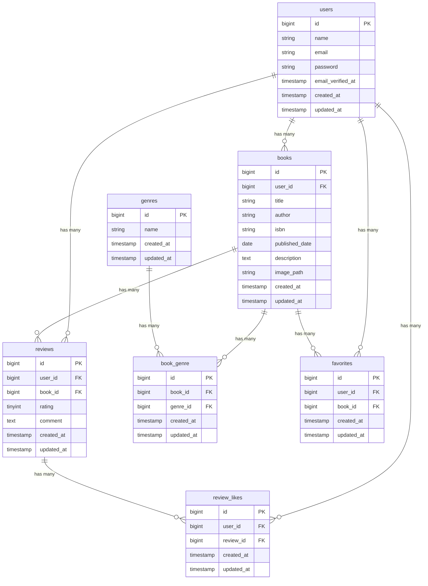

# 「bookshelf　書籍レビューアプリ」

## 概要

bookshelf-app は、書籍情報を管理するための Laravel 製 Web アプリケーションです。

書籍の登録・編集・削除に加えて、ジャンル管理、レビュー投稿、お気に入り登録、レビューへのいいね、評価ランキング表示、公開 API による書籍情報の取得・登録・更新・削除に対応しています。

## 開発環境URL

- アプリケーション: http://localhost/books
- phpMyAdmin: http://localhost:8080

## 作成目的

Laravel を用いた Web アプリケーション開発の学習を目的として作成しました。

MVC 構成、認証、CRUD 処理、バリデーション、リレーション、API 実装、Feature テストの理解を深めることを目的としています。

## 機能一覧

* 会員登録
* ログイン / ログアウト
* 書籍一覧表示
* 書籍詳細表示
* 書籍登録
* 書籍編集
* 書籍削除
* ジャンル一覧表示
* ジャンル詳細表示
* ジャンル登録
* ジャンル編集
* ジャンル削除
* レビュー投稿
* レビュー編集
* レビュー削除
* お気に入り登録 / 解除
* お気に入り一覧表示
* レビューへのいいね / 解除
* 評価ランキング表示
* 書籍公開 API

## 使用技術

* PHP ^8.1
* Laravel ^10.10
* Laravel Fortify
* Laravel Sanctum
* Laravel Sail
* MySQL 8.4
* phpMyAdmin
* Vite
* Tailwind CSS
* Alpine.js
* PHPUnit

## 環境構築

### 1. リポジトリをクローン

```bash
git clone git@github.com:honmatsubasa686-del/bookshelf-app.git
cd bookshelf-app
```

### 2. パッケージをインストール

```bash
composer install
npm install
```

### 3. 環境変数ファイルを作成

```bash
cp .env.example .env
```

Sail 環境で実行する場合は、`.env` のデータベース接続設定を以下のように変更します。

```env
DB_CONNECTION=mysql
DB_HOST=mysql
DB_PORT=3306
DB_DATABASE=laravel
DB_USERNAME=root
DB_PASSWORD=
```

### 4. コンテナを起動

```bash
./vendor/bin/sail up -d
```

### 5. アプリケーションキーを生成

```bash
./vendor/bin/sail artisan key:generate
```

### 6. マイグレーションとシーディングを実行

```bash
./vendor/bin/sail artisan migrate --seed
```

### 7. フロントエンドを起動

```bash
npm run dev
```

### 8. アプリケーションにアクセス

```text
http://localhost
```

phpMyAdmin は以下からアクセスできます。

```text
http://localhost:8080
```

## テーブル設計

### users テーブル

| カラム名              | 型         | 制約          |
| ----------------- | --------- | ----------- |
| id                | bigint    | primary key |
| name              | string    | not null    |
| email             | string    | unique      |
| email_verified_at | timestamp | nullable    |
| password          | string    | not null    |
| remember_token    | string    | nullable    |
| created_at        | timestamp | nullable    |
| updated_at        | timestamp | nullable    |

### books テーブル

| カラム名           | 型           | 制約                             |
| -------------- | ----------- | ------------------------------ |
| id             | bigint      | primary key                    |
| user_id        | foreignId   | foreign key, cascade on delete |
| title          | string      | not null                       |
| author         | string(120) | not null                       |
| isbn           | string(13)  | nullable                       |
| published_date | date        | not null                       |
| description    | text        | nullable                       |
| image_path     | string      | nullable                       |
| created_at     | timestamp   | nullable                       |
| updated_at     | timestamp   | nullable                       |

### genres テーブル

| カラム名       | 型         | 制約          |
| ---------- | --------- | ----------- |
| id         | bigint    | primary key |
| name       | string    | unique      |
| created_at | timestamp | nullable    |
| updated_at | timestamp | nullable    |

### book_genre テーブル

| カラム名       | 型         | 制約                             |
| ---------- | --------- | ------------------------------ |
| id         | bigint    | primary key                    |
| book_id    | foreignId | foreign key, cascade on delete |
| genre_id   | foreignId | foreign key, cascade on delete |
| created_at | timestamp | nullable                       |
| updated_at | timestamp | nullable                       |

`book_id` と `genre_id` の組み合わせは unique です。

### reviews テーブル

| カラム名       | 型                   | 制約                             |
| ---------- | ------------------- | ------------------------------ |
| id         | bigint              | primary key                    |
| user_id    | foreignId           | foreign key, cascade on delete |
| book_id    | foreignId           | foreign key, cascade on delete |
| rating     | unsignedTinyInteger | not null                       |
| comment    | text                | nullable                       |
| created_at | timestamp           | nullable                       |
| updated_at | timestamp           | nullable                       |

### favorites テーブル

| カラム名       | 型         | 制約                             |
| ---------- | --------- | ------------------------------ |
| id         | bigint    | primary key                    |
| user_id    | foreignId | foreign key, cascade on delete |
| book_id    | foreignId | foreign key, cascade on delete |
| created_at | timestamp | nullable                       |
| updated_at | timestamp | nullable                       |

`user_id` と `book_id` の組み合わせは unique です。

### review_likes テーブル

| カラム名       | 型         | 制約                             |
| ---------- | --------- | ------------------------------ |
| id         | bigint    | primary key                    |
| user_id    | foreignId | foreign key, cascade on delete |
| review_id  | foreignId | foreign key, cascade on delete |
| created_at | timestamp | nullable                       |
| updated_at | timestamp | nullable                       |

`user_id` と `review_id` の組み合わせは unique です。

## ER図



## API仕様

### APIエンドポイント一覧

| メソッド | エンドポイント | 内容 |
| --- | --- | --- |
| GET | /api/v1/books | 書籍一覧を取得 |
| GET | /api/v1/books?title=Laravel | 書籍をタイトルで検索 |
| GET | /api/v1/books/{book} | 書籍詳細を取得 |
| POST | /api/v1/books | 書籍を登録 |
| PUT | /api/v1/books/{book} | 書籍を更新 |
| DELETE | /api/v1/books/{book} | 書籍を削除 |

### 書籍一覧取得

```http
GET /api/v1/books
```

クエリパラメータでタイトル検索ができます。

```http
GET /api/v1/books?title=Laravel
```

レスポンス例：

```json
{
  "data": [
    {
      "id": 1,
      "title": "サンプルの本",
      "author": "サンプル著者",
      "isbn": "9784774193977",
      "published_date": "2026-07-01",
      "description": "説明文",
      "image_path": "books/sample.png",
      "created_at": "2026-07-01T00:00:00.000000Z",
      "updated_at": "2026-07-01T00:00:00.000000Z"
    }
  ],
  "meta": {
    "current_page": 1,
    "per_page": 12,
    "total": 1,
    "last_page": 1
  }
}
```

### 書籍詳細取得

```http
GET /api/v1/books/{book}
```

### 書籍登録

```http
POST /api/v1/books
```

リクエスト例：

```json
{
  "user_id": 1,
  "title": "API登録の本",
  "author": "テスト著者",
  "isbn": "9784101010014",
  "published_date": "2024-01-01",
  "description": "API登録テスト用の本です。",
  "genres": [1]
}
```

### 書籍更新

```http
PUT /api/v1/books/{book}
```

リクエスト例：

```json
{
  "user_id": 1,
  "title": "更新後の本",
  "author": "更新後の著者",
  "isbn": "9784101010021",
  "published_date": "2024-02-01",
  "description": "更新後の説明です。",
  "genres": [1]
}
```

### 書籍削除

```http
DELETE /api/v1/books/{book}
```

正常に削除された場合は、`204 No Content` を返します。

## テスト

Feature テストを実行する場合は、以下のコマンドを使用します。

```bash
./vendor/bin/sail artisan test
```

個別に実行する場合：

```bash
./vendor/bin/sail artisan test --filter=BookFeatureTest
./vendor/bin/sail artisan test --filter=ReviewFeatureTest
./vendor/bin/sail artisan test --filter=GenreFeatureTest
./vendor/bin/sail artisan test --filter=FavoriteFeatureTest
./vendor/bin/sail artisan test --filter=ReviewLikeFeatureTest
./vendor/bin/sail artisan test --filter=RankingFeatureTest
./vendor/bin/sail artisan test --filter=AuthFeatureTest
./vendor/bin/sail artisan test --filter=ApiBookFeatureTest
```

## 補足

PHP 8.5 環境では、以下の非推奨警告が表示される場合があります。

```text
Constant PDO::MYSQL_ATTR_SSL_CA is deprecated since 8.5, use Pdo\Mysql::ATTR_SSL_CA instead
```

この警告は PHP 8.5 由来の Deprecated 警告であり、テスト自体の失敗ではありません。

## リポジトリ

```text
https://github.com/honmatsubasa686-del/bookshelf-app
```

## 作成者

本間翼