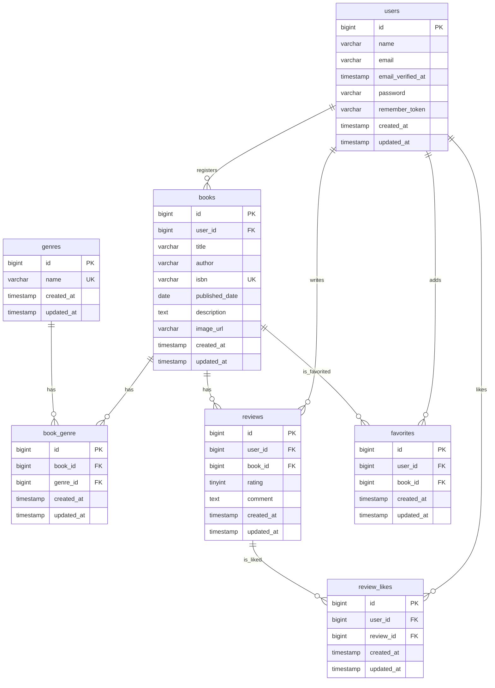

# ER図

```mermaid
erDiagram
    users {
        bigint id PK
        varchar name
        varchar email
        timestamp email_verified_at
        varchar password
        varchar remember_token
        timestamp created_at
        timestamp updated_at
    }

    books {
        bigint id PK
        bigint user_id FK
        varchar title
        varchar author
        varchar isbn UK
        date published_date
        text description
        varchar image_url
        timestamp created_at
        timestamp updated_at
    }

    genres {
        bigint id PK
        varchar name UK
        timestamp created_at
        timestamp updated_at
    }

    book_genre {
        bigint id PK
        bigint book_id FK
        bigint genre_id FK
        timestamp created_at
        timestamp updated_at
    }

    reviews {
        bigint id PK
        bigint user_id FK
        bigint book_id FK
        tinyint rating
        text comment
        timestamp created_at
        timestamp updated_at
    }

    favorites {
        bigint id PK
        bigint user_id FK
        bigint book_id FK
        timestamp created_at
        timestamp updated_at
    }

    review_likes {
        bigint id PK
        bigint user_id FK
        bigint review_id FK
        timestamp created_at
        timestamp updated_at
    }

    users ||--o{ books : registers
    users ||--o{ reviews : writes
    books ||--o{ reviews : has

    books ||--o{ book_genre : has
    genres ||--o{ book_genre : has

    users ||--o{ favorites : adds
    books ||--o{ favorites : is_favorited

    users ||--o{ review_likes : likes
    reviews ||--o{ review_likes : is_liked
```